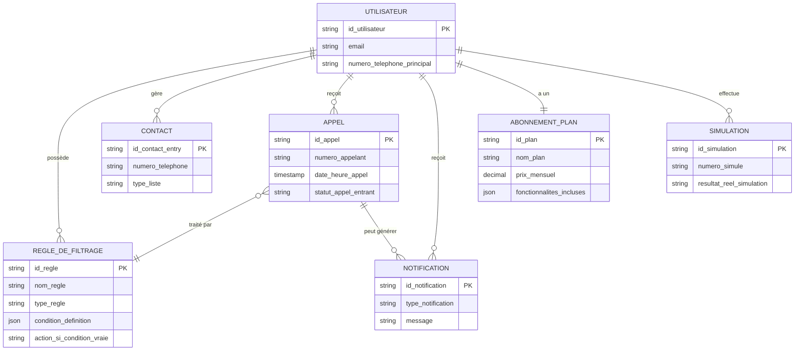

# Modèle de Domaine du Service de Filtrage d'Appels

Ce document décrit les principales entités de données, leurs attributs et les relations entre elles pour le service de filtrage d'appels "SerenKall".

## 1. Entités Principales

### 1.1. `Utilisateur` (User)
Représente une personne physique ou morale inscrite au service.

*   **Attributs :**
    *   `id_utilisateur` (UUID, PK): Identifiant unique.
    *   `nom_complet` (String): Nom et prénom ou raison sociale.
    *   `email` (String, Unique): Adresse email, utilisée pour la connexion et les notifications.
    *   `mot_de_passe_hash` (String): Mot de passe haché.
    *   `numero_telephone_principal` (String, Unique): Numéro de téléphone à protéger.
    *   `numeros_telephones_secondaires` (Array[String], Optionnel): Autres numéros associés au compte.
    *   `id_abonnement_actuel` (UUID, FK vers `Abonnement`): L'abonnement en cours.
    *   `date_inscription` (Timestamp): Date et heure de création du compte.
    *   `date_derniere_connexion` (Timestamp, Optionnel): Date et heure de la dernière connexion.
    *   `preferences_notifications` (Objet): Ex: `{ email: true, sms: false, push: true }`.
    *   `statut_compte` (Enum): Ex: `ACTIF`, `INACTIF`, `SUSPENDU`, `ESSAI`.
    *   `token_reinitialisation_mdp` (String, Optionnel): Token pour la réinitialisation du mot de passe.
    *   `date_expiration_token_reinit` (Timestamp, Optionnel).
    *   `est_admin` (Boolean, Default: false).
    *   // TEST: L'entité Utilisateur possède les attributs essentiels et leurs types sont définis.

*   **Relations :**
    *   Un `Utilisateur` possède plusieurs `RegleDeFiltrage` (1-N).
    *   Un `Utilisateur` possède plusieurs `Contact` (1-N).
    *   Un `Utilisateur` reçoit plusieurs `Appel` (1-N).
    *   Un `Utilisateur` peut avoir plusieurs `Notification` (1-N).
    *   Un `Utilisateur` a un `Abonnement` (1-1, via `id_abonnement_actuel`).
    *   Un `Utilisateur` peut effectuer plusieurs `Simulation` (1-N).
    *   // TEST: Les relations de l'entité Utilisateur sont correctement identifiées.

### 1.2. `Appel` (Call)
Représente un appel téléphonique entrant destiné à l'utilisateur.

*   **Attributs :**
    *   `id_appel` (UUID, PK): Identifiant unique de l'appel.
    *   `id_utilisateur` (UUID, FK vers `Utilisateur`): L'utilisateur recevant l'appel.
    *   `numero_appelant` (String): Numéro de téléphone de l'appelant.
    *   `numero_destinataire` (String): Numéro de l'utilisateur qui a été appelé (pertinent si plusieurs numéros).
    *   `date_heure_appel` (Timestamp): Quand l'appel a été reçu.
    *   `duree_appel_si_repondu` (Integer, Secondes, Optionnel): Durée si l'appel a abouti.
    *   `statut_appel_entrant` (Enum): Ex: `RECU`, `ANALYSE_EN_COURS`, `FILTRE_BLOQUE`, `FILTRE_AUTORISE`, `FILTRE_VERS_REPONDEUR`, `REPONDU_UTILISATEUR`, `NON_REPONDU`.
        *   // TEST: L'entité Appel a des statuts clairs pour son cycle de vie.
    *   `action_filtre_appliquee` (Enum, Optionnel): Ex: `BLOQUE_NUMERO`, `BLOQUE_ANONYME`, `AUTORISE_CONTACT`, `VERS_REPONDEUR_IA`.
    *   `id_regle_declenchee` (UUID, FK vers `RegleDeFiltrage`, Optionnel): La règle qui a traité l'appel.
    *   `transcription_message_repondeur_ia` (Texte, Optionnel): Si l'appel est allé au répondeur IA.
    *   `sentiment_analyse_repondeur_ia` (Enum, Optionnel): Ex: `POSITIF`, `NEGATIF`, `NEUTRE`, `URGENT`.
    *   `enregistrement_audio_url` (String, Optionnel): Lien vers l'enregistrement du message vocal (si applicable et autorisé).
    *   // TEST: L'entité Appel possède les attributs nécessaires pour le suivi et l'analyse.

*   **Relations :**
    *   Un `Appel` appartient à un `Utilisateur` (N-1).
    *   Un `Appel` peut être traité par une `RegleDeFiltrage` (N-1, optionnel).
    *   Un `Appel` peut générer une `Notification` (1-1 ou 1-N).
    *   // TEST: Les relations de l'entité Appel sont correctement identifiées.

### 1.3. `RegleDeFiltrage` (FilteringRule)
Définit les conditions et actions pour traiter les appels entrants.

*   **Attributs :**
    *   `id_regle` (UUID, PK): Identifiant unique de la règle.
    *   `id_utilisateur` (UUID, FK vers `Utilisateur`): Propriétaire de la règle.
    *   `nom_regle` (String): Nom descriptif donné par l'utilisateur (ex: "Bloquer numéros masqués").
    *   `type_regle` (Enum): Ex: `LISTE_NOIRE`, `LISTE_BLANCHE`, `MOTS_CLES_VOIX`, `HORAIRES`, `GEO_LOCALISATION_APPELANT`, `SYSTEME_ANTI_SPAM_ROO`.
        *   // TEST: Les types de règles sont bien définis et couvrent les besoins.
    *   `condition_definition` (Objet JSON): Structure variable selon `type_regle`.
        *   Ex pour `LISTE_NOIRE`: `{ numeros: ["+33xxxxxxxxx", "+44xxxxxxxxx"] }`
        *   Ex pour `HORAIRES`: `{ jours: ["LUN", "MAR"], heure_debut: "09:00", heure_fin: "18:00", action_hors_horaires: "VERS_REPONDEUR" }`
        *   // TEST: La structure des conditions de règles est flexible.
    *   `action_si_condition_vraie` (Enum): Ex: `BLOQUER`, `AUTORISER`, `VERS_REPONDEUR_IA`, `ALERTER_UTILISATEUR_PUIS_BLOQUER`, `ALERTER_UTILISATEUR_PUIS_AUTORISER`.
    *   `priorite` (Integer): Ordre d'application des règles (0 = plus haute).
    *   `est_active` (Boolean, Default: true): Permet de désactiver une règle sans la supprimer.
    *   `est_systeme` (Boolean, Default: false): True si c'est une règle fournie par SerenKall (non modifiable/supprimable par l'utilisateur standard).
    *   `date_creation` (Timestamp).
    *   `date_derniere_modification` (Timestamp).
    *   // TEST: L'entité RegleDeFiltrage possède les attributs pour une gestion fine du filtrage.

*   **Relations :**
    *   Une `RegleDeFiltrage` appartient à un `Utilisateur` (N-1).
    *   Une `RegleDeFiltrage` peut s'appliquer à plusieurs `Appel` (1-N).
    *   // TEST: Les relations de l'entité RegleDeFiltrage sont correctement identifiées.

### 1.4. `Contact` (ContactListEntry)
Représente une entrée dans la liste de contacts de l'utilisateur (pour liste blanche/noire).

*   **Attributs :**
    *   `id_contact_entry` (UUID, PK): Identifiant unique.
    *   `id_utilisateur` (UUID, FK vers `Utilisateur`): Propriétaire du contact.
    *   `numero_telephone` (String): Numéro de téléphone du contact.
    *   `nom_contact` (String, Optionnel): Nom associé au numéro.
    *   `type_liste` (Enum): Ex: `BLANCHE` (toujours autoriser), `NOIRE` (toujours bloquer).
    *   `date_ajout` (Timestamp).
    *   // TEST: L'entité Contact est bien définie pour la gestion des listes.

*   **Relations :**
    *   Un `Contact` appartient à un `Utilisateur` (N-1).
    *   // TEST: La relation de l'entité Contact est correctement identifiée.

### 1.5. `Abonnement` (Plan / Subscription)
Définit les caractéristiques d'un plan tarifaire. Il s'agit plus d'une définition de plan que de l'abonnement d'un utilisateur spécifique (voir `Utilisateur.id_abonnement_actuel` et potentiellement une table de jonction pour l'historique). Pour simplifier ici, on considère l'abonnement actif.

*   **Attributs (pour la définition du plan) :**
    *   `id_plan` (UUID, PK): Identifiant unique du type de plan.
    *   `nom_plan` (String): Ex: "Essentiel", "Premium", "Entreprise".
    *   `description` (Texte).
    *   `prix_mensuel` (Decimal).
    *   `prix_annuel` (Decimal, Optionnel).
    *   `devise` (String, Ex: "EUR").
    *   `limite_appels_filtres` (Integer, Optionnel): Null pour illimité.
    *   `fonctionnalites_incluses` (Objet JSON ou Array[String]): Ex: `["REPONDEUR_IA", "TRANSCRIPTION_STANDARD", "STATISTIQUES_BASE"]`.
    *   `support_niveau` (Enum, Optionnel): Ex: `EMAIL`, `CHAT`, `TELEPHONE_PRIORITAIRE`.
    *   `est_disponible` (Boolean, Default: true): Pour retirer un plan de la vente.
    *   // TEST: L'entité Abonnement (en tant que définition de plan) est complète.

*   **Attributs (pour l'instance d'abonnement d'un utilisateur - pourrait être une table `UtilisateurAbonnementHistorique`) :**
    *   `id_utilisateur_abonnement` (UUID, PK).
    *   `id_utilisateur` (UUID, FK).
    *   `id_plan` (UUID, FK).
    *   `date_debut` (Timestamp).
    *   `date_fin` (Timestamp, Optionnel pour les abonnements actifs sans fin définie).
    *   `statut_paiement` (Enum): Ex: `PAYE`, `EN_ATTENTE`, `ECHOUE`.
    *   `id_transaction_paiement` (String, Optionnel).
    *   // TEST: La distinction entre définition de plan et instance d'abonnement utilisateur est notée.

*   **Relations :**
    *   Un `Utilisateur` a un `Abonnement` (plan actuel).
    *   Un `Plan` (définition) peut être souscrit par plusieurs `Utilisateur`.
    *   // TEST: Les relations de l'entité Abonnement sont correctement identifiées.

### 1.6. `Notification` (Notification)
Message envoyé à l'utilisateur concernant un appel ou une activité du compte.

*   **Attributs :**
    *   `id_notification` (UUID, PK).
    *   `id_utilisateur` (UUID, FK vers `Utilisateur`).
    *   `id_appel_associe` (UUID, FK vers `Appel`, Optionnel).
    *   `type_notification` (Enum): Ex: `APPEL_BLOQUE`, `APPEL_AUTORISE_IMPORTANT`, `MESSAGE_REPONDEUR_IA`, `ALERTE_SECURITE_COMPTE`, `FIN_PERIODE_ESSAI`.
        *   // TEST: Les types de notifications sont variés et pertinents.
    *   `canal_envoi` (Enum): Ex: `EMAIL`, `SMS`, `PUSH_MOBILE`, `INTERFACE_WEB`.
    *   `titre` (String).
    *   `message` (Texte).
    *   `date_envoi` (Timestamp).
    *   `est_lue` (Boolean, Default: false).
    *   `date_lecture` (Timestamp, Optionnel).
    *   // TEST: L'entité Notification est bien structurée pour informer l'utilisateur.

*   **Relations :**
    *   Une `Notification` appartient à un `Utilisateur` (N-1).
    *   Une `Notification` peut être liée à un `Appel` (N-1, optionnel).
    *   // TEST: Les relations de l'entité Notification sont correctement identifiées.

### 1.7. `Simulation` (CallSimulation)
Enregistrement d'une tentative de simulation de filtrage par l'utilisateur.

*   **Attributs :**
    *   `id_simulation` (UUID, PK).
    *   `id_utilisateur` (UUID, FK vers `Utilisateur`).
    *   `numero_simule` (String): Le numéro que l'utilisateur a testé.
    *   `parametres_simulation` (Objet JSON, Optionnel): Ex: heure spécifique, type d'appelant (anonyme, etc.).
    *   `date_simulation` (Timestamp).
    *   `resultat_attendu_par_utilisateur` (Enum, Optionnel): Ex: `BLOQUE`, `AUTORISE`.
    *   `resultat_reel_simulation` (Enum): Ex: `BLOQUE`, `AUTORISE`, `VERS_REPONDEUR_IA`.
    *   `id_regle_declenchee_simulation` (UUID, FK vers `RegleDeFiltrage`, Optionnel).
    *   `explication_resultat` (Texte, Optionnel): Pourquoi ce résultat.
    *   // TEST: L'entité Simulation permet de tracer les tests utilisateurs.

*   **Relations :**
    *   Une `Simulation` est effectuée par un `Utilisateur` (N-1).
    *   // TEST: La relation de l'entité Simulation est correctement identifiée.

### 1.8. `StatistiqueAgregee` (AggregatedStatistic)
Données agrégées pour le tableau de bord de l'utilisateur. Ceci n'est pas une entité stockée directement sous cette forme mais plutôt le résultat de requêtes. On la liste pour la clarté du domaine.

*   **Exemples d'attributs (résultant d'agrégation) :**
    *   `id_utilisateur` (UUID, FK).
    *   `periode` (Enum ou DateRange): Ex: `JOUR_ACTUEL`, `SEMAINE_DERNIERE`, `MOIS_EN_COURS`.
    *   `nombre_appels_total_recus` (Integer).
    *   `nombre_appels_bloques` (Integer).
    *   `nombre_appels_autorises` (Integer).
    *   `nombre_appels_vers_repondeur` (Integer).
    *   `temps_moyen_economise_estime` (Integer, Minutes).
    *   `top_numeros_bloques` (Array[Objet]): Ex: `[{numero: "...", count: ...}]`.
    *   // TEST: La notion de StatistiqueAgregee est définie pour le reporting.

## 2. Types Enumérés Communs (Exemples)

*   `StatutAppelEntrant`: `RECU`, `ANALYSE_EN_COURS`, `FILTRE_BLOQUE`, `FILTRE_AUTORISE`, `FILTRE_VERS_REPONDEUR`, `REPONDU_UTILISATEUR`, `NON_REPONDU`
*   `ActionFiltreAppliquee`: `BLOQUE_NUMERO`, `BLOQUE_ANONYME`, `AUTORISE_CONTACT`, `VERS_REPONDEUR_IA`
*   `TypeRegle`: `LISTE_NOIRE`, `LISTE_BLANCHE`, `MOTS_CLES_VOIX`, `HORAIRES`, `GEO_LOCALISATION_APPELANT`, `SYSTEME_ANTI_SPAM_ROO`
*   `ActionSiConditionVraieRegle`: `BLOQUER`, `AUTORISER`, `VERS_REPONDEUR_IA`, `ALERTER_UTILISATEUR_PUIS_BLOQUER`, `ALERTER_UTILISATEUR_PUIS_AUTORISER`
*   `TypeListeContact`: `BLANCHE`, `NOIRE`
*   `TypeNotification`: `APPEL_BLOQUE`, `APPEL_AUTORISE_IMPORTANT`, `MESSAGE_REPONDEUR_IA`, `ALERTE_SECURITE_COMPTE`, `FIN_PERIODE_ESSAI`, `MISE_A_JOUR_REGLES_SYSTEME`
*   `CanalNotification`: `EMAIL`, `SMS`, `PUSH_MOBILE`, `INTERFACE_WEB`
*   `StatutCompteUtilisateur`: `ACTIF`, `INACTIF`, `SUSPENDU`, `EN_ATTENTE_VALIDATION_EMAIL`, `ESSAI_EN_COURS`, `ESSAI_EXPIRE`
    *   // TEST: Les types énumérés clarifient les valeurs possibles pour certains attributs.

## 3. Diagramme Simplifié des Relations (Conceptuel)

// TEST: Un diagramme conceptuel des relations est inclus.

Ce modèle de domaine servira de base pour la conception technique et le développement de la base de données. Il pourra être affiné au fur et à mesure de l'avancement du projet.