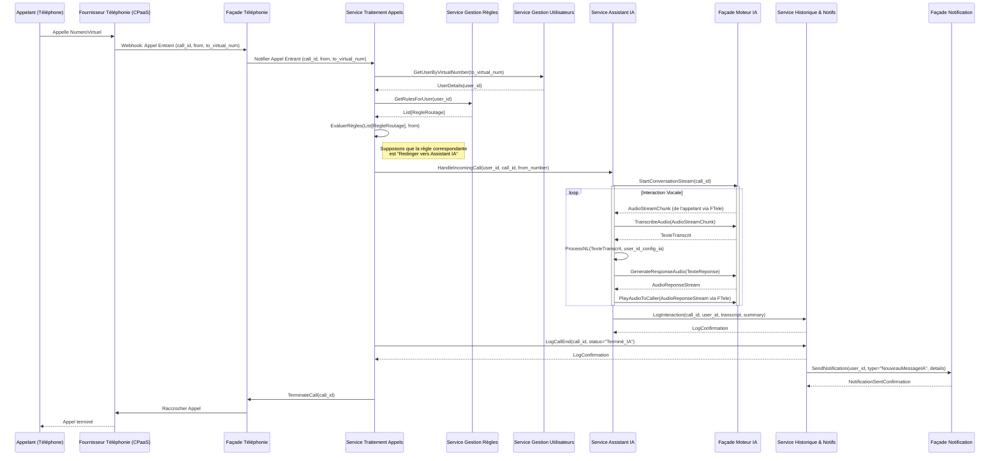

# Architecture Système du "Répondeur Intelligent"

## 1. Introduction

Ce document décrit l'architecture système du projet "Répondeur Intelligent". Il s'appuie sur les exigences fonctionnelles, le modèle de domaine et le pseudocode définis dans les documents de référence du projet situés dans les répertoires `docs/` et `pseudocode/`.

L'objectif est de proposer une architecture :
*   **Modulaire** : Composée de services indépendants avec des responsabilités clairement définies.
*   **Sécurisée** : Intégrant les meilleures pratiques pour la protection des données et des accès.
*   **Extensible** : Capable d'évoluer pour intégrer de nouvelles fonctionnalités et de s'adapter à une charge croissante.

## 2. Principes d'Architecture

L'architecture du "Répondeur Intelligent" repose sur les principes suivants :

*   **Décomposition en Services (Microservices ou Services bien délimités)** : Chaque fonctionnalité majeure est encapsulée dans un service distinct, favorisant la séparation des préoccupations, le déploiement indépendant et la scalabilité ciblée.
*   **Communication par API** : Les services communiquent entre eux via des API bien définies, principalement RESTful ou gRPC. Pour les opérations asynchrones et la résilience, un bus d'événements/files de messages sera envisagé.
*   **Centralisation de l'Authentification et de l'Autorisation** : Un service d'identité dédié (ou un fournisseur externe via une façade) gère l'authentification des utilisateurs et des services, ainsi que les autorisations d'accès.
*   **Sécurité Intégrée (Security by Design)** :
    *   Protection des données sensibles (chiffrement en transit avec TLS, chiffrement au repos).
    *   Validation systématique des entrées.
    *   Gestion sécurisée des secrets et configurations.
    *   Principe du moindre privilège pour les accès.
*   **Observabilité** : Mécanismes de logging, monitoring et tracing pour superviser la santé du système et diagnostiquer les problèmes.
*   **Extensibilité et Scalabilité** :
    *   Services conçus pour être stateless autant que possible.
    *   Possibilité de mise à l'échelle horizontale de chaque service.
    *   Utilisation de bases de données capables de supporter la charge et la croissance.
*   **Abstraction des Dépendances Externes** : Les services tiers (paiement, téléphonie, IA) sont accédés via des services de façade internes pour découpler l'application principale des implémentations spécifiques des fournisseurs.

## 3. Vue d'Ensemble de l'Architecture

### 3.1. Diagramme de Contexte (C4 Model - Niveau 1)

Ce diagramme montre le système "Répondeur Intelligent" dans son ensemble et ses interactions avec les utilisateurs et les systèmes externes.

```mermaid
graph TD
    subgraph Utilisateurs
        U_Client[Client / Utilisateur Final]
        U_Admin[Administrateur Système]
    end

    subgraph SystemeRepondeurIntelligent [Système Répondeur Intelligent]
        RepondeurApp[Application "Répondeur Intelligent"]
    end

    subgraph SystemesExternes [Systèmes Externes]
        SE_Telephonie[Fournisseur Téléphonie/VoIP (CPaaS)]
        SE_Paiement[Fournisseur Service de Paiement]
        SE_IA[Fournisseurs Services IA (STT, TTS, NLU)]
        SE_Notification[Fournisseur Service de Notification (Email/SMS)]
    end

    U_Client -- Gère son compte, ses règles, consulte l'historique via --> RepondeurApp
    U_Admin -- Administre la plateforme via --> RepondeurApp

    RepondeurApp -- Interagit pour les appels (émission/réception) avec --> SE_Telephonie
    RepondeurApp -- Traite les paiements et abonnements via --> SE_Paiement
    RepondeurApp -- Utilise pour la transcription, synthèse vocale, compréhension via --> SE_IA
    RepondeurApp -- Envoie des notifications (emails, SMS) via --> SE_Notification

    style SystemeRepondeurIntelligent fill:#lightblue,stroke:#333,stroke-width:2px
    style SystemesExternes fill:#lightgrey,stroke:#333,stroke-width:2px
```

### 3.2. Diagramme des Composants Principaux (Basé sur les Services Internes)

Ce diagramme détaille les principaux services/modules composant le "Répondeur Intelligent" et leurs interactions.

```mermaid
graph TD
    subgraph ClientInterfaces [Interfaces Utilisateur]
        WebApp[Application Web (Next.js) / Mobile]
    end

    subgraph CoreServices [Services Noyau du Répondeur Intelligent]
        API_Gateway[Passerelle API]

        S_Utilisateurs["Service Gestion Utilisateurs"]
        S_Regles["Service Gestion Règles"]
        S_Appels["Service Traitement Appels"]
        S_Historique["Service Historique & Notifications"]
        S_AssistantIA["Service Assistant IA"]
        S_Admin["Service Administration"]
    end

    subgraph SupportingServices [Services de Support / Façades]
        F_Auth["Service Authentification/Autorisation"]
        F_Paiement["Façade Service Paiement"]
        F_Telephonie["Façade Service Téléphonie"]
        F_IA["Façade Service Moteur IA"]
        F_Notification["Façade Service Notification Utilisateur"]
    end

    subgraph DataStores [Stockage de Données]
        DB_Principale[Base de Données Principale (SQL/NoSQL)]
        DB_Logs[Stockage des Logs]
    end

    subgraph ExternalServices [Services Externes (Référence)]
        Ext_Telephonie[Fournisseur Téléphonie]
        Ext_Paiement[Fournisseur Paiement]
        Ext_IA[Fournisseur IA]
        Ext_Notif[Fournisseur Notification]
    end

    WebApp -- HTTPS --> API_Gateway

    API_Gateway --> S_Utilisateurs
    API_Gateway --> S_Regles
    API_Gateway --> S_Appels
    API_Gateway --> S_Historique
    API_Gateway --> S_AssistantIA
    API_Gateway --> S_Admin
    API_Gateway -- Authentification/Autorisation --> F_Auth

    S_Utilisateurs -- CRUD, Auth --> DB_Principale
    S_Utilisateurs -- Authentification --> F_Auth
    S_Utilisateurs -- Paiements --> F_Paiement
    S_Utilisateurs -- Attribution numéros --> F_Telephonie

    S_Regles -- CRUD --> DB_Principale
    S_Regles -- Accès contrôlé par --> F_Auth

    S_Appels -- Déclenchement par webhook --> F_Telephonie
    S_Appels -- Récupère règles --> S_Regles
    S_Appels -- Récupère infos utilisateur --> S_Utilisateurs
    S_Appels -- Interagit avec --> S_AssistantIA
    S_Appels -- Enregistre historique --> S_Historique
    S_Appels -- CRUD états appels --> DB_Principale

    S_Historique -- CRUD --> DB_Principale
    S_Historique -- Envoie notifications via --> F_Notification

    S_AssistantIA -- Utilise capacités IA --> F_IA
    S_AssistantIA -- Interagit pour l'appel --> F_Telephonie
    S_AssistantIA -- Enregistre interaction --> S_Historique
    S_AssistantIA -- CRUD config IA --> DB_Principale

    S_Admin -- Opérations d'admin --> S_Utilisateurs
    S_Admin -- Opérations d'admin --> S_Regles
    S_Admin -- Consulte --> S_Historique
    S_Admin -- Accès privilégié via --> F_Auth
    S_Admin -- CRUD config système --> DB_Principale
    S_Admin -- Accède aux logs --> DB_Logs

    F_Paiement -- Intégration --> Ext_Paiement
    F_Telephonie -- Intégration --> Ext_Telephonie
    F_IA -- Intégration --> Ext_IA
    F_Notification -- Intégration --> Ext_Notif

    %% Services écrivent des logs
    S_Utilisateurs -- Logs --> DB_Logs
    S_Regles -- Logs --> DB_Logs
    S_Appels -- Logs --> DB_Logs
    S_Historique -- Logs --> DB_Logs
    S_AssistantIA -- Logs --> DB_Logs
    S_Admin -- Logs --> DB_Logs
    F_Auth -- Logs --> DB_Logs

    style CoreServices fill:#lightblue,stroke:#333,stroke-width:2px
    style SupportingServices fill:#lightgreen,stroke:#333,stroke-width:2px
    style DataStores fill:#orange,stroke:#333,stroke-width:2px
    style ClientInterfaces fill:#lightyellow,stroke:#333,stroke-width:2px
```

## 4. Description Détaillée des Composants et Services

Cette section détaille chaque composant identifié, ses responsabilités, son interface principale (API) et les données qu'il gère.
Nous nous basons sur la décomposition de [`docs/06_architecture_globale_et_dependances.md`](docs/06_architecture_globale_et_dependances.md).

### 4.1. Application Web/Mobile (Client Interface)
*   **Responsabilités** : Fournir l'interface utilisateur pour l'inscription, la connexion, la gestion du profil, la configuration des règles de routage, la consultation de l'historique des appels, la configuration de l'assistant IA et l'accès aux fonctionnalités d'administration (pour les administrateurs).
*   **Technologie (Exemple)** : Next.js pour le web.
*   **Interactions** : Communique avec la Passerelle API via HTTPS.

### 4.2. Passerelle API (API Gateway)
*   **Responsabilités** : Point d'entrée unique pour toutes les requêtes clientes. Elle assure le routage des requêtes vers les services internes appropriés, l'authentification/autorisation (en collaboration avec le Service d'Authentification), la limitation de débit (rate limiting), et potentiellement la transformation de requêtes/réponses.
*   **Interactions** : Reçoit les requêtes de l'application cliente, les valide (partiellement), s'assure de l'authentification/autorisation via `F_Auth`, et les route vers les services noyau.

### 4.3. Service d'Authentification/Autorisation (`F_Auth`)
*   **Responsabilités** :
    *   Vérifier les identifiants des utilisateurs et des services.
    *   Émettre, valider et rafraîchir les jetons d'accès (ex: JWT).
    *   Gérer les rôles et les permissions.
    *   Peut être une façade pour un fournisseur d'identité externe (OAuth2/OIDC provider comme Keycloak, Auth0, ou un service cloud IAM).
*   **API (Exemples)** :
    *   `POST /auth/token` (login, échange de credentials pour token)
    *   `POST /auth/token/refresh` (rafraîchissement de token)
    *   `GET /auth/userinfo` (validation de token et récupération d'infos utilisateur)
*   **Données gérées** : Peut stocker des informations minimales sur les sessions ou s'appuyer sur le stockage du fournisseur d'identité.

### 4.4. Service Gestion Utilisateurs (`S_Utilisateurs`)
*   **Référence** : [`pseudocode/01_module_gestion_utilisateurs.md`](pseudocode/01_module_gestion_utilisateurs.md)
*   **Responsabilités** :
    *   Inscription et gestion du cycle de vie des utilisateurs.
    *   Gestion des profils utilisateurs.
    *   Gestion des abonnements et coordination avec la `Façade Service Paiement`.
    *   Attribution et gestion des numéros de téléphone virtuels (en coordination avec `Façade Service Téléphonie`).
*   **API (Exemples d'endpoints via API Gateway)** :
    *   `POST /users/register`
    *   `GET /users/me`
    *   `PUT /users/me/profile`
    *   `GET /users/me/subscription`
    *   `POST /users/me/subscription` (créer/modifier abonnement)
    *   `GET /users/me/virtual-numbers`
    *   `POST /users/me/virtual-numbers` (demander/configurer un numéro)
*   **Données gérées (dans `DB_Principale`)** : `Utilisateur`, `Abonnement`, `NumeroVirtuel`, `TransactionPaiement` (références).

### 4.5. Service Gestion Règles (`S_Regles`)
*   **Référence** : [`pseudocode/02_module_gestion_regles.md`](pseudocode/02_module_gestion_regles.md)
*   **Responsabilités** :
    *   Permettre aux utilisateurs de créer, lire, mettre à jour et supprimer des règles de routage d'appels personnalisées.
    *   Évaluer les règles pour un appel donné (peut être appelé par `S_Appels`).
*   **API (Exemples d'endpoints via API Gateway)** :
    *   `POST /users/me/rules`
    *   `GET /users/me/rules`
    *   `GET /users/me/rules/{ruleId}`
    *   `PUT /users/me/rules/{ruleId}`
    *   `DELETE /users/me/rules/{ruleId}`
    *   (Interne) `POST /internal/rules/evaluate` (appelé par `S_Appels`)
*   **Données gérées (dans `DB_Principale`)** : `RegleRoutage`, `ConditionRegle`, `ActionRegle`.

### 4.6. Service Traitement Appels (`S_Appels`)
*   **Référence** : [`pseudocode/03_module_traitement_appels.md`](pseudocode/03_module_traitement_appels.md)
*   **Responsabilités** :
    *   Orchestrer le traitement des appels entrants.
    *   Recevoir les notifications d'appels entrants (webhooks) depuis la `Façade Service Téléphonie`.
    *   Identifier l'utilisateur destinataire.
    *   Récupérer et déclencher l'évaluation des règles de routage auprès de `S_Regles`.
    *   Appliquer l'action de la règle : transférer l'appel (via `F_Telephonie`), rediriger vers `S_AssistantIA`, prendre un message vocal (via `S_AssistantIA` ou une fonction dédiée).
    *   Notifier `S_Historique` des événements d'appel.
*   **API (Principalement interne et webhooks)** :
    *   `POST /webhooks/telephony/incoming-call` (endpoint exposé à `F_Telephonie`)
    *   Interactions internes avec `S_Regles`, `S_Utilisateurs`, `S_AssistantIA`, `S_Historique`, `F_Telephonie`.
*   **Données gérées (états transitoires, référence à `DB_Principale` pour l'historique)**.

### 4.7. Service Historique & Notifications (`S_Historique`)
*   **Référence** : [`pseudocode/04_module_historique_notifications.md`](pseudocode/04_module_historique_notifications.md)
*   **Responsabilités** :
    *   Enregistrer les détails de chaque appel traité (appelant, appelé, durée, statut, transcriptions, etc.).
    *   Permettre la consultation de l'historique des appels par les utilisateurs.
    *   Gérer et envoyer des notifications aux utilisateurs (nouveaux messages, appels manqués, etc.) via `F_Notification`.
*   **API (Exemples d'endpoints via API Gateway)** :
    *   `GET /users/me/call-history`
    *   `GET /users/me/call-history/{callId}`
    *   `POST /internal/call-history` (appelé par `S_Appels` ou `S_AssistantIA` pour enregistrer des événements)
*   **Données gérées (dans `DB_Principale`)** : `HistoriqueAppel`, `NotificationUtilisateur`.

### 4.8. Service Assistant IA (`S_AssistantIA`)
*   **Référence** : [`pseudocode/05_module_assistant_ia_interactions.md`](pseudocode/05_module_assistant_ia_interactions.md)
*   **Responsabilités** :
    *   Gérer les interactions conversationnelles entre l'appelant et l'assistant IA.
    *   Utiliser la `Façade Service Moteur IA` pour la reconnaissance vocale (STT), la compréhension du langage naturel (NLU), la génération de réponses (NLG) et la synthèse vocale (TTS).
    *   Prendre des messages, extraire des informations.
    *   Permettre aux utilisateurs de configurer certains aspects de leur assistant IA (personnalité, messages d'accueil).
    *   Enregistrer les interactions et transcriptions dans `S_Historique`.
*   **API (Principalement interne, appelé par `S_Appels`)** :
    *   `POST /internal/assistant-ia/handle-interaction`
    *   (Via API Gateway) `GET /users/me/assistant-config`
    *   (Via API Gateway) `PUT /users/me/assistant-config`
*   **Données gérées (dans `DB_Principale`)** : `ConfigurationAssistantIAUtilisateur`, contribution à `HistoriqueAppel`.

### 4.9. Service Administration (`S_Admin`)
*   **Référence** : [`pseudocode/06_module_administration_systeme.md`](pseudocode/06_module_administration_systeme.md)
*   **Responsabilités** :
    *   Fournir une interface aux administrateurs pour gérer la plateforme.
    *   Gestion des utilisateurs (création, modification, suspension).
    *   Consultation des logs système.
    *   Configuration globale du système.
    *   Monitoring de la plateforme.
*   **API (Exemples d'endpoints via API Gateway, accès restreint aux administrateurs)** :
    *   `GET /admin/users`
    *   `PUT /admin/users/{userId}/status`
    *   `GET /admin/system-logs`
    *   `GET /admin/system-config`
    *   `PUT /admin/system-config`
*   **Données gérées (dans `DB_Principale` et `DB_Logs`)** : `AdministrateurSysteme`, `ConfigurationGlobaleSysteme`, `LogAuditSysteme`.

### 4.10. Façades des Services Externes
Ces services servent de couche d'abstraction entre les services noyau du Répondeur Intelligent et les fournisseurs externes. Cela permet de changer de fournisseur plus facilement et de centraliser la logique d'intégration.

*   **Façade Service Paiement (`F_Paiement`)**
    *   Interface avec Stripe, PayPal, etc.
    *   API interne : `creer_abonnement`, `verifier_statut_paiement`.
*   **Façade Service Téléphonie (`F_Telephonie`)**
    *   Interface avec Twilio, Vonage, etc.
    *   API interne : `recevoir_appel_entrant_webhook`, `passer_appel_sortant`, `transferer_appel`, `jouer_audio`, `raccrocher_appel`, `attribuer_numero_virtuel`.
*   **Façade Service Moteur IA (`F_IA`)**
    *   Interface avec Google AI, AWS AI, OpenAI, etc.
    *   API interne : `transcrire_audio_en_texte`, `convertir_texte_en_audio`, `analyser_intention`, `generer_reponse`.
*   **Façade Service Notification Utilisateur (`F_Notification`)**
    *   Interface avec SendGrid, Twilio SMS, etc.
    *   API interne : `envoyer_email`, `envoyer_sms`.

### 4.11. Bases de Données
*   **Base de Données Principale (`DB_Principale`)**:
    *   Stocke toutes les données persistantes de l'application (utilisateurs, règles, historique, configurations).
    *   Pourrait être une base de données relationnelle (ex: PostgreSQL) pour la consistance des données et les relations complexes, ou NoSQL (ex: MongoDB) pour la flexibilité et la scalabilité de certains types de données (comme l'historique des appels ou les configurations JSON). Un choix hybride est aussi possible.
*   **Stockage des Logs (`DB_Logs`)**:
    *   Stocke les logs d'application, d'audit et de performance.
    *   Pourrait être une solution spécialisée comme Elasticsearch (ELK Stack) ou un service cloud de logging.

## 5. Flux de Données Détaillés (Diagrammes de Séquence)

### 5.1. Flux d'un Appel Entrant avec Redirection vers Assistant IA


## 6. Modèle de Données Conceptuel (Entités Principales)

Ce diagramme illustre les principales entités de données et leurs relations, basé sur [`docs/05_modele_domaine.md`](docs/05_modele_domaine.md) et les entités listées dans [`docs/06_architecture_globale_et_dependances.md`](docs/06_architecture_globale_et_dependances.md).

```mermaid
erDiagram
    Utilisateur {
        string id PK
        string nom
        string email
        string mot_de_passe_hash
        datetime date_creation
        string id_abonnement FK
        string id_config_ia FK
    }

    Abonnement {
        string id PK
        string type_abonnement
        datetime date_debut
        datetime date_fin
        string statut_paiement
        string id_fournisseur_paiement
    }

    NumeroVirtuel {
        string id PK
        string numero_telephone
        string id_utilisateur FK
        string id_fournisseur_telephonie
        boolean est_actif
    }

    RegleRoutage {
        string id PK
        string id_utilisateur FK
        string nom_regle
        integer priorite
        boolean est_active
    }

    ConditionRegle {
        string id PK
        string id_regle_routage FK
        string type_condition (ex: "appelant", "horaire")
        string operateur_condition
        string valeur_condition
    }

    ActionRegle {
        string id PK
        string id_regle_routage FK
        string type_action (ex: "transferer_numero", "vers_messagerie", "vers_ia")
        string parametres_action (JSON)
    }

    HistoriqueAppel {
        string id PK
        string id_utilisateur FK
        string id_numero_virtuel FK
        string numero_appelant
        datetime date_heure_debut
        datetime date_heure_fin
        string statut_appel (ex: "repondu", "manque", "ia_traite")
        string enregistrement_url (optionnel)
        string transcription_texte (optionnel)
        string resume_ia (optionnel)
    }

    NotificationUtilisateur {
        string id PK
        string id_utilisateur FK
        string id_historique_appel FK (optionnel)
        string type_notification (ex: "appel_manque", "nouveau_message_vocal", "resume_ia")
        string contenu_message
        datetime date_envoi
        string statut_envoi (ex: "envoye", "echec")
    }

    ConfigurationAssistantIAUtilisateur {
        string id PK
        string id_utilisateur FK
        string message_accueil_personnalise
        string personnalite_assistant (JSON de configuration)
        string langue_preference
    }

    TransactionPaiement {
        string id PK
        string id_abonnement FK
        datetime date_transaction
        float montant
        string devise
        string statut_transaction
        string id_transaction_fournisseur
    }

    AdministrateurSysteme {
        string id PK
        string nom_utilisateur
        string mot_de_passe_hash
        string role (ex: "super_admin", "support")
    }

    ConfigurationGlobaleSysteme {
        string id PK
        string cle_configuration
        string valeur_configuration
        string description
    }

    LogAuditSysteme {
        string id PK
        datetime timestamp
        string id_administrateur_systeme FK (optionnel)
        string action_effectuee
        string details_action (JSON)
    }

    Utilisateur ||--o{ Abonnement : "possède un"
    Utilisateur ||--o{ NumeroVirtuel : "possède plusieurs"
    Utilisateur ||--o{ RegleRoutage : "configure plusieurs"
    Utilisateur ||--o{ HistoriqueAppel : "a plusieurs entrées d'"
    Utilisateur ||--o{ NotificationUtilisateur : "reçoit plusieurs"
    Utilisateur ||--|{ ConfigurationAssistantIAUtilisateur : "configure un"
    Abonnement ||--o{ TransactionPaiement : "a plusieurs"
    RegleRoutage ||--o{ ConditionRegle : "contient plusieurs"
    RegleRoutage ||--o{ ActionRegle : "définit plusieurs"
    HistoriqueAppel }o--|| NotificationUtilisateur : "peut déclencher une" (optionnel)
    AdministrateurSysteme ||--o{ LogAuditSysteme : "peut générer plusieurs" (optionnel)

    classDef pk fill:#lightgreen,stroke:#333,stroke-width:2px;
    classDef fk fill:#lightblue,stroke:#333,stroke-width:2px;
    class Utilisateur,Abonnement,NumeroVirtuel,RegleRoutage,ConditionRegle,ActionRegle,HistoriqueAppel,NotificationUtilisateur,ConfigurationAssistantIAUtilisateur,TransactionPaiement,AdministrateurSysteme,ConfigurationGlobaleSysteme,LogAuditSysteme pk
    class Utilisateur_id_abonnement,Utilisateur_id_config_ia,NumeroVirtuel_id_utilisateur,RegleRoutage_id_utilisateur,ConditionRegle_id_regle_routage,ActionRegle_id_regle_routage,HistoriqueAppel_id_utilisateur,HistoriqueAppel_id_numero_virtuel,NotificationUtilisateur_id_utilisateur,NotificationUtilisateur_id_historique_appel,ConfigurationAssistantIAUtilisateur_id_utilisateur,TransactionPaiement_id_abonnement,LogAuditSysteme_id_administrateur_systeme fk
```

## 7. Considérations de Déploiement

L'architecture proposée, basée sur des services, se prête bien à un déploiement conteneurisé.

*   **Conteneurisation** : Chaque service (S_Utilisateurs, S_Regles, F_Paiement, etc.), y compris la Passerelle API et l'Application Web, sera packagé dans un conteneur Docker.
*   **Orchestration de Conteneurs** : Kubernetes (K8s) est le choix privilégié pour l'orchestration, la gestion des déploiements, la mise à l'échelle, le service discovery et la résilience.
    *   Chaque service correspondra à un Déploiement K8s.
    *   Les services seront exposés en interne via des Services K8s.
    *   La Passerelle API sera exposée à l'extérieur via un Ingress Controller.
*   **Infrastructure Cloud** :
    *   Un fournisseur cloud majeur (AWS, GCP, Azure) sera utilisé pour héberger l'environnement Kubernetes (ex: EKS, GKE, AKS).
    *   Services managés pour les bases de données (ex: RDS, Cloud SQL, Cosmos DB), le stockage des logs (ex: CloudWatch Logs, Elasticsearch Service), et potentiellement pour le bus de messages (ex: SQS, Pub/Sub, Event Grid).
*   **CI/CD (Intégration Continue / Déploiement Continu)** :
    *   Un pipeline CI/CD automatisé (ex: Jenkins, GitLab CI, GitHub Actions) sera mis en place pour :
        *   Construire les images Docker.
        *   Exécuter les tests unitaires et d'intégration.
        *   Pousser les images vers un registre de conteneurs (ex: ECR, GCR, Docker Hub).
        *   Déployer les nouvelles versions sur Kubernetes (stratégies de déploiement blue/green ou canary).
*   **Configuration et Secrets Management** :
    *   La configuration des services sera externalisée (ex: ConfigMaps K8s).
    *   Les secrets (clés d'API, mots de passe de base de données) seront gérés de manière sécurisée (ex: Secrets K8s, HashiCorp Vault, services de gestion de secrets du cloud provider).
*   **Monitoring et Logging** :
    *   Prometheus et Grafana pour le monitoring des métriques des services et de l'infrastructure K8s.
    *   Stack ELK (Elasticsearch, Logstash, Kibana) ou des services cloud équivalents pour la centralisation et l'analyse des logs.
    *   Tracing distribué (ex: Jaeger, Zipkin) pour suivre les requêtes à travers les services.

### Exemple d'Environnements :
*   **Développement** : Peut tourner localement (Minikube, Docker Desktop) ou sur un cluster K8s dédié.
*   **Staging/Pré-production** : Environnement miroir de la production pour les tests finaux.
*   **Production** : Cluster K8s hautement disponible, réparti sur plusieurs zones de disponibilité.

## 8. Sécurité

La sécurité est une préoccupation majeure et doit être intégrée à toutes les étapes de la conception et du développement ("Security by Design").

### 8.1. Authentification et Autorisation
*   **Authentification Forte** :
    *   Utilisation de `F_Auth` (basé sur OAuth2/OIDC) pour l'authentification des utilisateurs et des services.
    *   Mots de passe stockés avec des algorithmes de hachage robustes et salés (ex: Argon2, bcrypt).
    *   Mise en place de l'Authentification Multi-Facteurs (MFA/2FA) pour les utilisateurs, en particulier pour les administrateurs.
    *   Jetons JWT (JSON Web Tokens) avec une durée de vie limitée pour les sessions API, avec des mécanismes de rafraîchissement sécurisés.
*   **Autorisation Granulaire** :
    *   Principe du moindre privilège : les utilisateurs et services n'ont accès qu'aux ressources et opérations strictement nécessaires à leurs fonctions.
    *   Contrôle d'accès basé sur les rôles (RBAC) géré par `F_Auth` et appliqué par la Passerelle API et les services individuels.
    *   Validation des permissions à chaque point d'accès aux ressources.

### 8.2. Protection des Données
*   **Chiffrement en Transit** :
    *   TLS/HTTPS obligatoire pour toutes les communications externes (entre client et Passerelle API) et internes (entre services). Utilisation de certificats TLS robustes.
*   **Chiffrement au Repos** :
    *   Chiffrement des données sensibles dans `DB_Principale` (ex: informations personnelles des utilisateurs, détails de paiement si stockés temporairement, transcriptions d'appels).
    *   Utilisation des mécanismes de chiffrement fournis par le service de base de données managé (ex: AWS KMS avec RDS).
    *   Chiffrement des sauvegardes de la base de données.
*   **Gestion des Données Personnelles (RGPD/CCPA)** :
    *   Mécanismes pour l'anonymisation ou la pseudonymisation des données si nécessaire.
    *   Procédures pour la suppression des données utilisateur sur demande.
    *   Politique de conservation des données claire.

### 8.3. Sécurité des API
*   **Validation des Entrées** : Validation rigoureuse de toutes les données entrantes au niveau de la Passerelle API et de chaque service pour prévenir les attaques par injection (SQLi, XSS, etc.). Utilisation de schémas de validation.
*   **Protection contre les Attaques Courantes** :
    *   Limitation de débit (Rate Limiting) et blocage d'IP au niveau de la Passerelle API pour prévenir les abus et les attaques DoS/DDoS.
    *   Utilisation d'un Web Application Firewall (WAF) en amont de la Passerelle API.
    *   Protection contre les attaques CSRF (Cross-Site Request Forgery) pour l'application web.
    *   Headers de sécurité HTTP (Content Security Policy, X-Content-Type-Options, X-Frame-Options, HSTS).
*   **Gestion des Webhooks Sécurisée** :
    *   Validation de la source des webhooks entrants (ex: vérification de signature, liste blanche d'IP pour `F_Telephonie`).

### 8.4. Sécurité de l'Infrastructure et du Déploiement
*   **Gestion des Secrets** :
    *   Aucun secret (clés d'API, mots de passe, certificats) ne doit être codé en dur dans le code ou les images Docker.
    *   Utilisation de solutions de gestion des secrets (HashiCorp Vault, Secrets K8s, AWS Secrets Manager, Azure Key Vault).
*   **Sécurité des Conteneurs** :
    *   Images Docker minimales et durcies.
    *   Scan régulier des images pour les vulnérabilités (ex: Trivy, Clair).
    *   Principe du moindre privilège pour les processus dans les conteneurs (ne pas exécuter en root).
*   **Sécurité Réseau (Kubernetes)** :
    *   Network Policies dans Kubernetes pour restreindre la communication entre les pods/services.
    *   Segmentation du réseau.
*   **Mises à Jour et Patchs** : Politique de mise à jour régulière des dépendances logicielles, des systèmes d'exploitation, et des images de base des conteneurs.

### 8.5. Logging et Monitoring de Sécurité
*   **Logs d'Audit Détaillés** : Enregistrement des événements de sécurité importants (tentatives de connexion, accès aux données sensibles, modifications de configuration) dans `LogAuditSysteme` et `DB_Logs`.
*   **Alertes de Sécurité** : Mise en place d'alertes en temps réel pour les activités suspectes ou les violations de sécurité détectées via le monitoring.
*   **Analyses de Vulnérabilités et Tests d'Intrusion** : Planifier des scans de vulnérabilités réguliers et des tests d'intrusion par des tiers.

### 8.6. Façades et Services Externes
*   **Validation des Certificats** : Les façades doivent valider les certificats TLS des services externes qu'elles appellent.
*   **Gestion des Clés d'API Externes** : Stockage sécurisé et rotation régulière des clés d'API utilisées pour interagir avec les fournisseurs tiers.

## 9. Extensibilité et Scalabilité

L'architecture est conçue pour permettre une croissance et une évolution fluides du système.

### 9.1. Scalabilité Horizontale des Services
*   **Services Stateless** : La majorité des services principaux (`S_Utilisateurs`, `S_Regles`, `S_Appels`, `S_Historique`, `S_AssistantIA`, `S_Admin`) sont conçus pour être stateless autant que possible. L'état est persisté dans `DB_Principale` ou géré par des services d'état externes (ex: Redis pour le cache de session).
*   **Conteneurisation (Kubernetes)** : Chaque service est conteneurisé (Docker) et déployé sur un orchestrateur comme Kubernetes. Kubernetes permet la mise à l'échelle horizontale automatique (Horizontal Pod Autoscaler - HPA) en fonction de métriques comme l'utilisation CPU ou la mémoire.
*   **Passerelle API Scalable** : La `Passerelle API` peut également être mise à l'échelle horizontalement pour gérer un grand nombre de requêtes entrantes.
*   **Load Balancing** : Des load balancers sont utilisés devant la Passerelle API et potentiellement entre les services (via le service mesh de Kubernetes) pour distribuer la charge.

### 9.2. Scalabilité des Bases de Données
*   **`DB_Principale`** :
    *   Si PostgreSQL est choisi : Utilisation de réplicas en lecture pour décharger la base de données principale. Possibilité de sharding à long terme si la charge en écriture devient très élevée.
    *   Si NoSQL (MongoDB) est choisi : Le sharding est nativement supporté pour la scalabilité horizontale.
    *   Utilisation de services de bases de données managées (AWS RDS, Azure Database, Google Cloud SQL/Spanner) qui offrent des options de scalabilité.
*   **`DB_Logs` (Elasticsearch)** : Elasticsearch est nativement conçu pour la scalabilité horizontale.

### 9.3. Communication Asynchrone et Découplage
*   **Bus d'Événements / File de Messages (Optionnel mais Recommandé)** : Pour les opérations qui ne nécessitent pas de réponse immédiate ou pour améliorer la résilience entre services (ex: traitement post-appel pour la génération de résumé IA, envoi de notifications complexes).
    *   Exemples : Kafka, RabbitMQ, AWS SQS/SNS.
    *   Permet aux services de consommer des messages à leur propre rythme, améliorant la résilience face aux pics de charge ou aux pannes temporaires d'un service.
    *   Par exemple, `S_Appels` pourrait publier un événement "AppelTermine" et `S_Historique` ainsi que `S_AssistantIA` (pour des analyses post-appel) pourraient s'y abonner.

### 9.4. Extensibilité pour de Nouvelles Fonctionnalités
*   **Architecture Modulaire** : L'ajout de nouvelles fonctionnalités peut souvent se traduire par l'ajout de nouveaux services ou la modification ciblée de services existants sans impacter l'ensemble du système.
    *   Exemple : Ajout d'un service d'analyse de sentiments sur les appels. Ce nouveau service pourrait consommer des événements d'appel ou être appelé par `S_AssistantIA`.
*   **Façades pour Services Externes** : L'utilisation de façades (`F_Telephonie`, `F_IA`, `F_Paiement`, `F_Notification`) facilite le remplacement ou l'ajout de nouveaux fournisseurs externes sans modification majeure des services principaux.
*   **Versioning des API** : Mettre en place une stratégie de versioning des API (ex: `/v1/users`, `/v2/users`) pour permettre l'évolution des interfaces sans casser les intégrations existantes.

### 9.5. Monitoring et Observabilité pour la Scalabilité
*   Le monitoring continu des performances des services et des bases de données (via Prometheus, Grafana, ELK Stack) est crucial pour identifier les goulots d'étranglement et prendre des décisions éclairées sur la mise à l'échelle.

(La section Exemples d'API suivra)
## 10. Exemples d'API (Interfaces Externes Principales)

Cette section donne un aperçu des endpoints API clés qui seraient exposés par la `Passerelle API` aux clients (Application Web/Mobile) et aux services externes (comme les webhooks des fournisseurs de téléphonie). Ces exemples sont illustratifs et non exhaustifs.

### 10.1. API Utilisateur (pour l'Application Client)

Protégée par le service `F_Auth`.

*   **Authentification**
    *   `POST /api/v1/auth/login` : Connexion utilisateur.
        *   Request Body: `{ "email": "user@example.com", "password": "password123" }`
        *   Response: `{ "accessToken": "...", "refreshToken": "..." }`
    *   `POST /api/v1/auth/register` : Inscription nouvel utilisateur.
        *   Request Body: `{ "nom": "Nom", "email": "newuser@example.com", "password": "securePassword!" }`
        *   Response: `201 Created`, `{ "userId": "...", "email": "..." }`
    *   `POST /api/v1/auth/refresh-token` : Rafraîchir le jeton d'accès.
        *   Request Body: `{ "refreshToken": "..." }`
        *   Response: `{ "accessToken": "..." }`
    *   `GET /api/v1/auth/me` : Obtenir les informations de l'utilisateur connecté.
        *   Response: `{ "userId": "...", "nom": "...", "email": "..." }`

*   **Gestion du Compte Utilisateur (`S_Utilisateurs`)**
    *   `GET /api/v1/users/me/profile` : Obtenir le profil de l'utilisateur.
    *   `PUT /api/v1/users/me/profile` : Mettre à jour le profil.
    *   `GET /api/v1/users/me/subscription` : Obtenir les détails de l'abonnement.
    *   `POST /api/v1/users/me/subscription` : S'abonner ou modifier l'abonnement.
    *   `GET /api/v1/users/me/virtual-numbers` : Lister les numéros virtuels de l'utilisateur.
    *   `POST /api/v1/users/me/virtual-numbers` : Acquérir/configurer un nouveau numéro virtuel.

*   **Gestion des Règles (`S_Regles`)**
    *   `POST /api/v1/users/me/rules` : Créer une nouvelle règle de routage.
        *   Request Body: (détails de la règle, conditions, actions)
    *   `GET /api/v1/users/me/rules` : Lister toutes les règles de l'utilisateur.
    *   `GET /api/v1/users/me/rules/{ruleId}` : Obtenir une règle spécifique.
    *   `PUT /api/v1/users/me/rules/{ruleId}` : Mettre à jour une règle.
    *   `DELETE /api/v1/users/me/rules/{ruleId}` : Supprimer une règle.

*   **Historique des Appels (`S_Historique`)**
    *   `GET /api/v1/users/me/call-history` : Lister l'historique des appels (avec pagination, filtres).
    *   `GET /api/v1/users/me/call-history/{callId}` : Obtenir les détails d'un appel spécifique (incluant transcription, résumé IA si disponible).

*   **Configuration Assistant IA (`S_AssistantIA`)**
    *   `GET /api/v1/users/me/assistant-config` : Obtenir la configuration actuelle de l'assistant IA.
    *   `PUT /api/v1/users/me/assistant-config` : Mettre à jour la configuration de l'assistant IA.

### 10.2. API de Webhooks (pour les Services Externes)

Ces endpoints sont appelés par les fournisseurs externes.

*   **Fournisseur Téléphonie (`F_Telephonie` -> `S_Appels`)**
    *   `POST /webhooks/telephony/incoming-call` : Notifie un nouvel appel entrant.
        *   Request Body: (Spécifique au fournisseur, ex: Twilio TwiML ou format JSON avec `call_sid`, `from`, `to`, etc.)
    *   `POST /webhooks/telephony/call-status` : Notifie un changement de statut d'appel (raccroché, en cours, etc.).

*   **Fournisseur Paiement (`F_Paiement` -> `S_Utilisateurs`)**
    *   `POST /webhooks/payment/status` : Notifie un statut de paiement (réussi, échoué, remboursement).
        *   Request Body: (Spécifique au fournisseur, ex: Stripe event JSON)

### 10.3. API Administrateur (Accès restreint)

Protégée par `F_Auth` avec des rôles administrateur.

*   `GET /api/v1/admin/users` : Lister tous les utilisateurs.
*   `GET /api/v1/admin/users/{userId}` : Obtenir les détails d'un utilisateur.
*   `PUT /api/v1/admin/users/{userId}/status` : Modifier le statut d'un utilisateur (actif, suspendu).
*   `GET /api/v1/admin/system-logs` : Consulter les logs système.
*   `GET /api/v1/admin/system-config` : Obtenir la configuration globale.
*   `PUT /api/v1/admin/system-config` : Mettre à jour la configuration globale.

## 11. Conclusion

L'architecture proposée pour le "Répondeur Intelligent" vise à établir une fondation solide, modulaire, sécurisée et évolutive. En s'appuyant sur une décomposition en services clairs, des interfaces API bien définies, et en intégrant la sécurité et l'observabilité dès la conception, ce système est conçu pour répondre aux exigences fonctionnelles actuelles tout en permettant une croissance future.

Les principes clés de séparation des préoccupations, d'abstraction des dépendances externes et de communication asynchrone (via un bus d'événements si nécessaire pour certains flux) sont essentiels pour atteindre la résilience et la maintenabilité.

Les prochaines étapes impliqueront le raffinement des détails de chaque service, la sélection des technologies spécifiques pour chaque composant (bases de données, langages de programmation pour les services, fournisseurs de cloud, etc.), et la mise en place d'un pipeline CI/CD robuste pour le déploiement et la gestion continus. Une attention particulière devra être portée au choix des fournisseurs de services externes (Téléphonie, IA, Paiement) pour s'assurer de leur fiabilité, de leur performance et de leur conformité aux exigences de sécurité et de confidentialité.

Cette architecture sert de guide pour le développement et l'évolution du "Répondeur Intelligent", en s'assurant que les décisions techniques futures s'alignent sur les objectifs à long terme du projet.